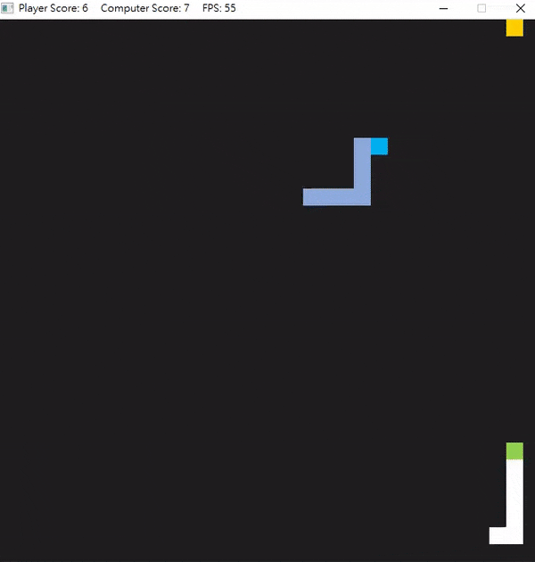

# CPPND: Capstone Autonomous Snake Game 

The code for this repo is based on [Udacity Capstone Snake Game Example](https://github.com/udacity/CppND-Capstone-Snake-Game).

In this project, player controls one snake agaist one self-navigated snake, whose action is base on a path searching algorithm. Expansion method is the core for constructing the path.

In this project, player controls one snake agaist one self-navigated snake, whose action is base on a real time path searching. Expansion method is used for constructing the path.  

## Code Structure

## Rubic Points

1. The project demonstrates an understanding of C++ functions and control structures.  
2. The project uses Object Oriented Programming techniques.  
3. Classes use appropriate access specifiers for class members.  
3.1. members are specified as public and protected in class snake (snake.h)
3.2. members are specified as public and private in class snake (auto_snake.h)
4. Class constructors utilize member initialization lists.  
4.1. game.cpp - line 7
4.2. snake.h - line 12
4.3. auto_snake.h - line 16  
5. Classes abstract implementation details from their interfaces.  
6. Classes encapsulate behavior.  
7. Classes follow an appropriate inheritance hierarchy.  
7.1. class auto_snake inheritate from class snake
7.2. composition: game.h - line 26
8. Derived class functions override virtual base class functions.  
8.1. virtual function: snake.h - line 42
8.2. override: auto_snake.h - line 21
9. The project makes use of references in function declarations. 
10. The project uses move semantics to move data, instead of copying it, where possible.  
10.1. auto_snake.h - line 16
11. The project uses multithreading.  
11.1. game.cpp - line 70  
12. A mutex or lock is used in the project.  
12.1. unique_lock: snake.cpp - line 37, auto_snake.cpp - line 78, 

  

## Dependencies for Running Locally
* cmake >= 3.7
  * All OSes: [click here for installation instructions](https://cmake.org/install/)
* make >= 4.1 (Linux, Mac), 3.81 (Windows)
  * Linux: make is installed by default on most Linux distros
  * Mac: [install Xcode command line tools to get make](https://developer.apple.com/xcode/features/)
  * Windows: [Click here for installation instructions](http://gnuwin32.sourceforge.net/packages/make.htm)
* SDL2 >= 2.0
  * All installation instructions can be found [here](https://wiki.libsdl.org/Installation)
  * Note that for Linux, an `apt` or `apt-get` installation is preferred to building from source.
* gcc/g++ >= 5.4
  * Linux: gcc / g++ is installed by default on most Linux distros
  * Mac: same deal as make - [install Xcode command line tools](https://developer.apple.com/xcode/features/)
  * Windows: recommend using [MinGW](http://www.mingw.org/)

## Basic Build Instructions

1. Clone this repo.
2. Make a build directory in the top level directory: `mkdir build && cd build`
3. Compile: `cmake .. && make`
4. Run it: `./SnakeGame`.