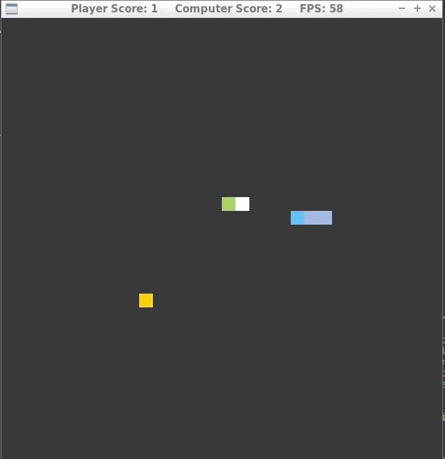
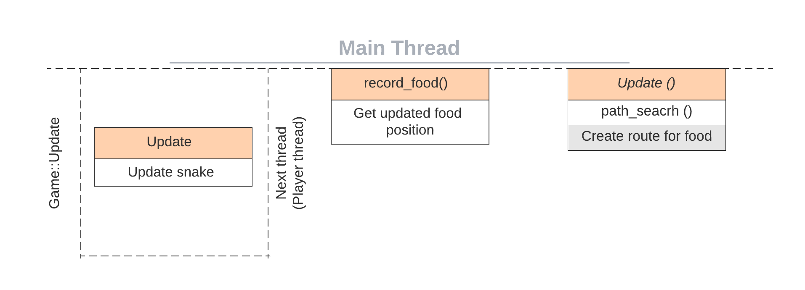

# CppND: Capstone Snake Game 

The code is based on original baseline [Udacity Capstone Snake Game project](https://github.com/udacity/CppND-Capstone-Snake-Game).


<p align="center">

</p>


## Code Structure

<p align="center">

</p>

In this project, one snake is self navigated using search algorithm, expansion method and other snake is controlled by player. If player's snake hits walls or computer snake, game ends there.

## Rubric Points

### Loops, Functions, I/O
1. C++ functions and control structures are demonstrated.  
2. User input is considered by a function.
   #### snake.h 23 code snippet shows the base function used for user input
   ```cpp
    enum Direction
   {kUp, kDown, kLeft, kRight, unknown};
   ```

### Object Oriented Programming
1. Advanced OOP techniques are used. 
2. Access specifiers are used by Classes to access class members.  
   * Public and protected members in class snake [snake.h], 
   * Public and private members in class snake [comp_snake.h].
3. Member initialization list is used by Class constructor.
   * Examples are game.cpp 8 and game.cpp 13
     #### comp_snake.h 17 code snippet shows initialization list
     ```cpp
     Comp_snake(const int &grid_width, const int &grid_height, int &&num) : 
     Snake(grid_width, grid_height, std::move(num))
     ```
4. Appropriate commenting is used to show implementation details.
   #### comp_snake.cpp 14 code snippet shows commenting
   ```cpp
   // Capture the head's cell before updating.
      SDL_Point prev_cell{
      static_cast<int>(head_x),
      static_cast<int>(head_y)}; 
   ```
5. Behavior is encapsulated by Classes.
   #### comp_snake.h 14 - 59 shows Class Comp_snake
   ```cpp
   class Comp_snake : public Snake
   ```
6. Inheritance hierarchy is followed in implementation. 
    #### comp_snake.h 14 code snippet shows Comp_snake inherit from base class Snake
    ```cpp
    class Comp_snake : public Snake
    ```
7. Virtual base class functions are overidden by derived class functions.
    #### snake.h 43 code snippet shoiws virtual function
    ```cpp
    virtual void Update(const Snake &other);
    ```
    #### comp_snake.h 22 code snippet shows overriden activity
    ```cpp
    void Update(const Snake &other) override;
    ```
8. Implementation details are abstracted from interfaces by Classes.
    
### Memory Management 
1. Call by Reference method is used for passing arguments to functions.
   #### comp_snake.h 56 code snippet shows Call by Reference method
   ```cpp
   bool path_search(std::vector<std::vector<Direction>> &direction_arr, 
   const SDL_Point &food, const SDL_Point &head, int &&grid_width, int &&grid_height);
   ```
2. Destructor is used in fuctions.
   #### rendere.h 14 code snippet shows use of deconstructor
   ```cpp
   public:
   Renderer(const std::size_t &screen_width, const std::size_t &screen_height,
           const std::size_t &grid_width, const std::size_t &grid_height);
   ~Renderer();
   ```
3. Move semantics is used to move the data.
    #### snake.h 13 code snippet shows move semantics
    ```cpp
    Snake(const int &grid_width, const int &grid_height, int &&num)
    ```
4. Smart pointers are used to prevent memory leak.
   #### comp_snake.cpp 119 code snippet shows the use of smart pointer
   ```cpp
   while (current->x != start.x || current->y != start.y)
    {
      direction_arr[current->parent.x][current->parent.y] = current->action;
      current = &close_mtx[current->parent.x][current->parent.y];
    }
    ```

### Concurrency
1. Multithreading is used in the implementation.
   #### game.cpp 68 code snippet shows the player is initialized onto different thread
   ```cpp
   std::future<void> update_snake = std::async(&Snake::Update, &snake, comp_snake);
   ```
2. Mutex is used to protect the data.
   #### comp_snake.cpp 69 and snake.cpp 37 code snippet shows the mutex
   ```cpp
   std::unique_lock<std::mutex> lock_obj(mutlock);
   ```


## Dependencies for Running Locally
* cmake >= 3.7
  * All OSes: [click here for installation instructions](https://cmake.org/install/)
* make >= 4.1 (Linux, Mac), 3.81 (Windows)
  * Linux: make is installed by default on most Linux distros
  * Mac: [install Xcode command line tools to get make](https://developer.apple.com/xcode/features/)
  * Windows: [Click here for installation instructions](http://gnuwin32.sourceforge.net/packages/make.htm)
* SDL2 >= 2.0
  * All installation instructions can be found [here](https://wiki.libsdl.org/Installation)
  * Note that for Linux, an `apt` or `apt-get` installation is preferred to building from source.
* gcc/g++ >= 5.4
  * Linux: gcc / g++ is installed by default on most Linux distros
  * Mac: same deal as make - [install Xcode command line tools](https://developer.apple.com/xcode/features/)
  * Windows: recommend using [MinGW](http://www.mingw.org/)

## Basic Build Instructions

1. Clone this repo.
2. Make a build directory in the top level directory: `mkdir build && cd build`
3. Compile: `cmake .. && make`
4. Run it: `./SnakeGame`.
